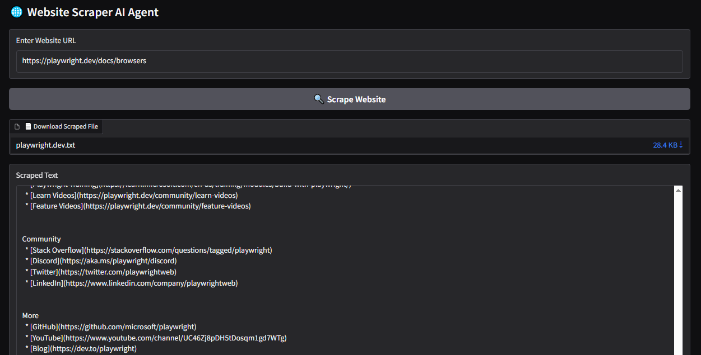
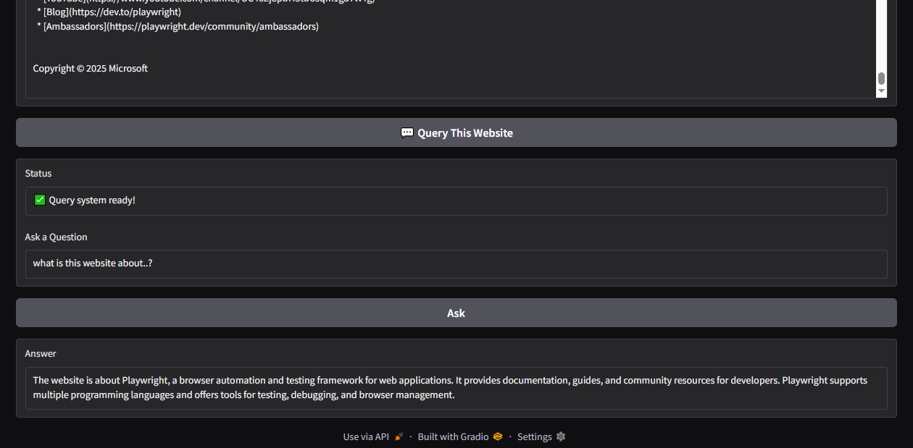

# 🕸️ WebScraper AI Agent


AI-powered web scraper that extracts and processes website content using Crawl4AI, LangChain, HuggingFace Embeddings, FAISS, and GROQ LLMs. It features a simple Gradio UI and allows users to download extracted text and ask intelligent questions from web data.

---

## 🚀 Features

- 🌐 Crawl websites asynchronously with `Crawl4AI`
- 📄 Extract and chunk website text data
- 🧾 Download extracted content as a `.txt` file
- 🤖 Embed content using `HuggingFaceEmbeddings`
- 🔍 Perform semantic search using `FAISS`
- 💬 Answer questions using GROQ LLM (via LangChain)
- 🎛️ Clean and interactive UI using `Gradio`

---

## 🧰 Tech Stack

- Python
- LangChain
- FAISS
- HuggingFace Transformers
- Crawl4AI
- Gradio
- GROQ LLM
- dotenv

---

## 📦 Installation

1. **Clone the Repo**
   ```bash
   git clone https://github.com/jasoncobra3/WebScraper_AI_Agent.git
   cd WebScraper_AI_Agent

2. **Create Virtual Environment**
   ```bash
    python -m venv venv
   
3. **Activate the Virtual Environment**
   ```bash
    # Windows:
    venv\Scripts\activate
    # macOS/Linux:
    venv/bin/activate

4. **Install Dependencies**
   ```bash
   pip install -r requirements.txt

---
## 🔐 Setup
1. **Create a `.env` file in root folder with**
   ```env
    GROQ_API_KEY=your_groq_api_key_here
   ```

---

##  🧪Run the App
   **Run the Script in Terminal**
   ```bash
     python app.py
   ```

---

## 📁 Project Structure
```
├── app.py
├── requirements.txt
├── .env
├── .gitignore
├── README.md
└── Assets/
```
---
## 📸 Screenshots

| 🌐 Scraping Website|Semantic Search 📄 |
|---------------|------------------|
|  | |

---

## 🤝 Contributing

Pull requests are welcome. For major changes, please open an issue first to discuss what you’d like to change.

